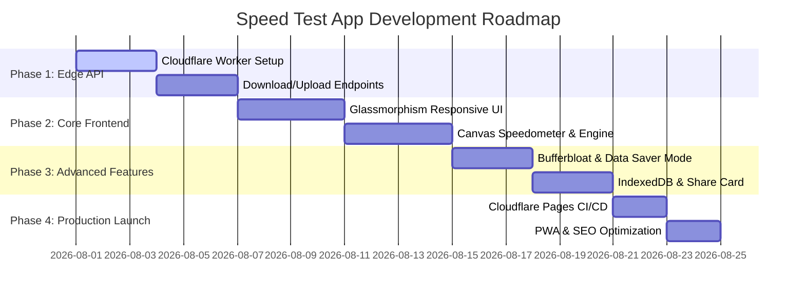

# 05. Master Execution Plan & Deployment Roadmap

## Executive Summary
This document provides a step-by-step master execution roadmap for building, testing, and deploying the new Internet Speed Test Application live on Cloudflare Pages and Cloudflare Workers for zero cost.

---

## 1. Project Phasing & Timeline

---

## 2. Step-by-Step Implementation Guide

### Step 1: Cloudflare Edge Worker API Implementation
* Initialize `wrangler` CLI project.
* Create `/api/ping` with ultra-fast json response.
* Create `/api/download` using `ReadableStream` chunking with `Cache-Control: no-store`.
* Create `/api/upload` stream reader.
* Deploy Worker to Cloudflare (`*.workers.dev`).

### Step 2: Responsive Frontend UI Development
* Build responsive HTML5 container layout.
* Implement Cyber Glassmorphism CSS variables and theme system.
* Build custom 60fps HTML5 Canvas speedometer gauge with smooth needle animation.
* Integrate Network Information API and IP location detection.

### Step 3: Core Measurement Engine
* Implement warm-up RTT phase (100KB chunks).
* Implement adaptive multi-thread & single-thread download stream controller.
* Implement upload stream controller.
* Calculate Jitter and Bufferbloat (Loaded Latency).
* Add "Data Saver Mode" 5MB payload limit toggle.

### Step 4: Storage, Shareability & PWA
* Setup client-side `IndexedDB` storage engine for test history timeline.
* Add HTML5 Canvas PNG Share Card generator.
* Create PWA `manifest.json` and static service worker shell.

### Step 5: Zero-Cost Cloudflare Pages Deployment
* Connect GitHub repository to Cloudflare Pages.
* Configure custom domain or free `*.pages.dev` subdomain.
* Setup environment bindings between Cloudflare Pages and Cloudflare Workers.

---

## 3. Summary of Files Created in Research Directory

All research documentation has been successfully compiled and saved to `D:\InternetSpeedTest_Research`:

* 📄 `D:\InternetSpeedTest_Research\01_competitor_analysis_and_user_pain_points.md`
* 📄 `D:\InternetSpeedTest_Research\02_features_and_ux_architecture.md`
* 📄 `D:\InternetSpeedTest_Research\03_tech_stack_and_zero_cost_hosting_comparison.md`
* 📄 `D:\InternetSpeedTest_Research\04_backend_telemetry_and_data_strategy.md`
* 📄 `D:\InternetSpeedTest_Research\05_master_execution_plan_and_roadmap.md`
